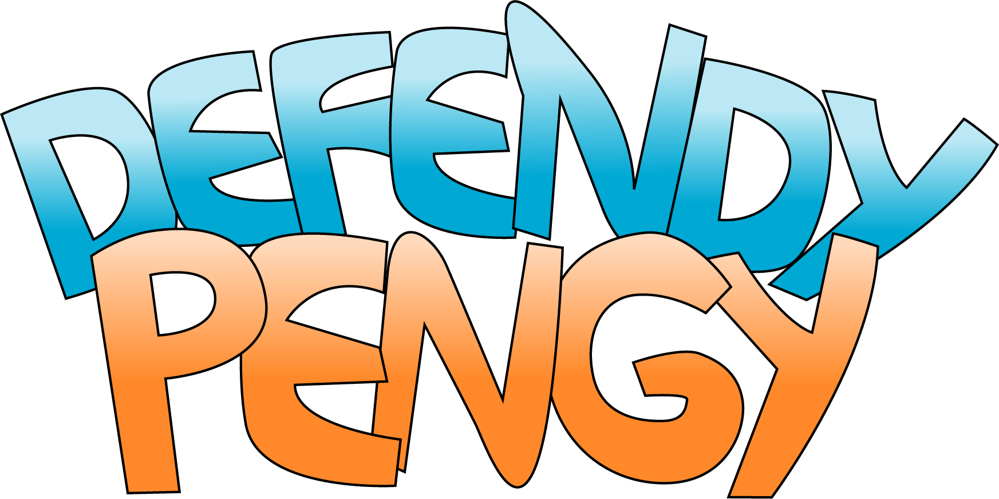
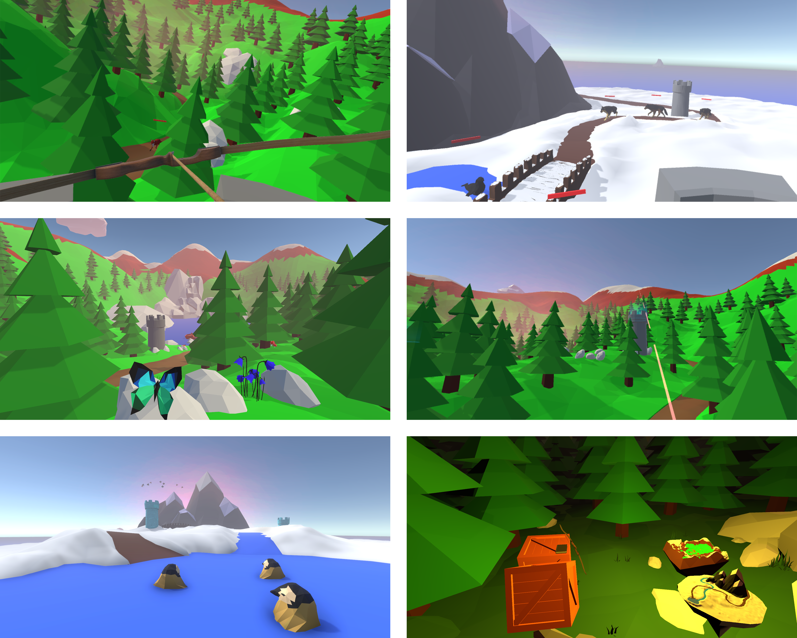

 

Defendy Pengy er et tower defence-inspirert spill med et hjemmekoselig dyretema. I Defendy Pengy skal du beskytte små, søte pingvinunger mot ville dyr som er ute etter å spise dem. Du kan teleportere mellom tårn og velge mellom å bruke pil og bue eller magi som våpen. Det er to verdener med forskjellig vanskelighetsgrad som du kan prøve ut.

På [releases-siden](https://github.com/hackerspace-ntnu/Defendy-Pengy/releases) ligger det en ferdigbygd versjon av spillet, som du kan laste ned og kjøre hvis du har en HTC Vive eller Oculus Rift.

Pull requests mottas med åpne armer!

## Om prosjektet
Dette er et prosjekt som ble gjennomført av VR-gruppa i Hackerspace NTNU over en periode på ett år.

Du kan lese mer om prosjektet og gruppa på nettsiden vår: https://hackerspace-ntnu.no/groups/prosjekt-vr

## Medlemmer

Leder: [eskarpnes](https://github.com/eskarpnes)

Nestleder: [haakov](https://github.com/haakov)

Utviklere:
 - [ArneMartin](https://github.com/ArneMartin)
 - [ddabble](https://github.com/ddabble)
 - [haigol](https://github.com/haigol)
 - [yDragonChan](https://github.com/yDragonChan)

Grafisk:
 - [dukefoss](https://github.com/dukefoss)
 - [MiriamFi](https://github.com/MiriamFi)
 - [oddaspa](https://github.com/oddaspa)
 - [trebor292](https://github.com/trebor292)

Lyd:
 - [manathalie](https://github.com/manathalie)
 - [Mattis52](https://github.com/Mattis52)

## Screenshots

 

---

### Guide for merging av scene-filer (.unity) og prefab-filer ligger på [wikien](https://github.com/hackerspace-ntnu/Defendy-Pengy/wiki/Merging-av-scene-filer-(.unity)-og-prefab-filer).
